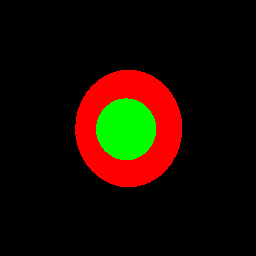
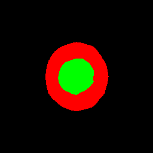
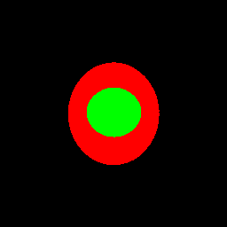
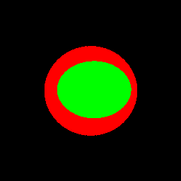

# semantic-segmentation-on-Glaucoma-image
应用FCN和Siamese网络对青光眼图像进行语义分割

256fcn：该文件夹为测试数据集  
output:该文件夹为测试生成的图片保存的地址

test：
python3 test.py -c

accurate：
python3 accurate.py

这里给出的测试数据集只有10张图片，效果如下：
1-IOU:0.9276562733798149,disc:0.9592168002434818,cup:0.8915862986365148
2-IOU:0.9185947687641814,disc:0.945882830744238,cup:0.886241610738255
3-IOU:0.9272984498541681,disc:0.9674335010783609,cup:0.9222880254225047
4-IOU:0.9013996668810907,disc:0.9428117553613979,cup:0.905379513633014
5-IOU:0.8877736244678566,disc:0.9807059660353872,cup:0.8336713995943205
6-IOU:0.9276806430720548,disc:0.9642857142857143,cup:0.9094224924012158
7-IOU:0.9200935770092783,disc:0.980058651026393,cup:0.8575076608784474
8-IOU:0.9235290585772908,disc:0.9704060564349621,cup:0.9013472403302912
9-IOU:0.8914886717955103,disc:0.9356892415574829,cup:0.8600833129135016
10-IOU:0.9070216735708891,disc:0.9581230749066125,cup:0.8863703267589049
MIOU：0.9132536407372136
disc，cup：[0.96046136 0.88538979]

   
   
   
   

在本实验中测试数据集共100张，MIOU为0.853114210680038，disc：0.94730368，cup：0.78880154，详细数据看result.txt文件
